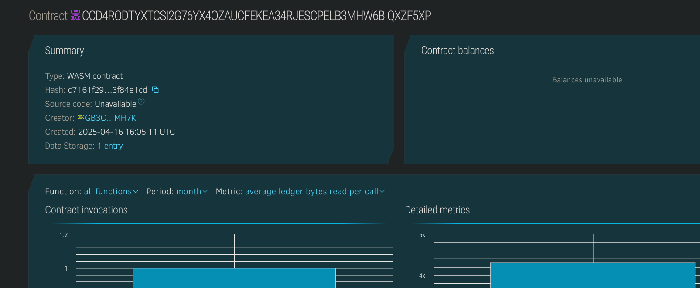

# Rental Agreement Smart Contract

## Project Description
The **Rental Agreement Smart Contract** digitizes and automates rental agreements between landlords and tenants using Soroban smart contracts on the Stellar blockchain. It allows both parties to securely sign agreements, track payment history, and manage rental terms with transparency.

## Project Vision
To streamline and secure rental processes with trustless digital agreements, enabling decentralized property rentals with immutability and automatic enforcement of terms.

## Key Features
- Register new rental agreements between landlords and tenants.
- Record rent amount, duration, and payment status.
- Tenants can pay rent, and the contract records each payment.
- View agreement and payment details.

## Future Scope
- Add automated rent reminders and penalties for late payment.
- Implement deposit refund logic based on property condition.
- Extend support for subletting and amendment clauses.
- Allow dispute resolution and arbitration mechanisms.

## Contract Details
CCD4RODTYXTCSI2G76YX4OZAUCFEKEA34RJESCPELB3MHW6BIQXZF5XP
